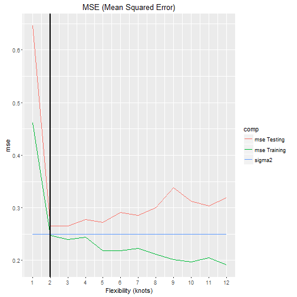

## Introduction

* The [Bias-Variance App](https://josean1.shinyapps.io/App_bias_variance/) shows how the next fundamental property in Statistical Learning works: There is a general pattern in the relation of MSE's (Mean Squared Errors) versus the model flexibility: U-shape in the Testing MSE and monotone decrease in the Training set one. This pattern is held regardless the data set or the statistical learning method we choose.

* In order to obtain the test MSE and its components, we will assume that the population features are known and, therefore, we will be able to build the sample distributions by simulation.

* Given the above feature, it will be possible to change some of the parameters that define the population or the model (App inputs) and showing the effects of the changes in the relation ot the MSE versus the flexibility of the model. We are going to see that this MSE pattern is held for any set of inputs.   

* References:  
 - [Cap 2: & 2.2.2."The Bias-Variance Trade-Off" from Gareth James et alter.](http://www-bcf.usc.edu/~gareth/ISL/)    
 - [the clever machine](https://theclevermachine.wordpress.com/2013/04/21/model-selection-underfitting-overfitting-and-the-bias-variance-tradeoff/)

--- .class #id 

## Input values and assumptions

* x, the quantitative predictor has a uniform distribution where its limits can be chosen.
* y, the quantitative outcome, is defined with a known true function f(x)= cos (x)) and a random error (epsilon).   
  y = f(x)+ epsilon, where epsilon -> N( 0, sigma ). -sigma can be also chosen-. 
* the sample size can be chosen.
* The simulations size is 50 and the percentage of training set size is 60 %.
* Spline method is the Statistical method. To change the flexibility level, the knots number is used. From knots=1, that adjust a straight line -the lowest level of flexibility- to 12 -the highest one-, that obtains a extremely adjusted function to the true function of the population. 
* The App obtains the optimum level for the knots. This is the one where the lowest testing MSE is achieved. But, we can also change it to see the results in terms of bias/variance trade off. 

--- .class #id 

## Output plots

There are three plots to see the results:

1. Data set with the "true function" and the "estimate y".  
We can see, for each level of flexibility, the adjustment of the 50 simulations and its mean(estimate y). When the knots increases, the adjustment to the true function is better, but the variance of the simulations is higher. The clear red lines are more deviated around its mean.

2. MSE in training and testing set versus the model flexibility.  
The general pattern of the MSE shape is showed here: In the case of testing set the MSE has a U shape with a minimum level. But, in the case of training set, the MSE shows a monotone decrease evolution. This is the property to check by the App. There is an example in the next slide.

3. Testing MSE components: MSE ~= sigma^2 + bias^2 + variance.  
The last plot explains the performance of the testing MSE. The U-shape is generated by the tradeoff between the bias and the variance of the estimate y when the flexibility increases. 

--- .class #id
## Example: The plot #2 for a given data set
We can observe U-shape for the testing MSE and decreasing line for the training MSE.

